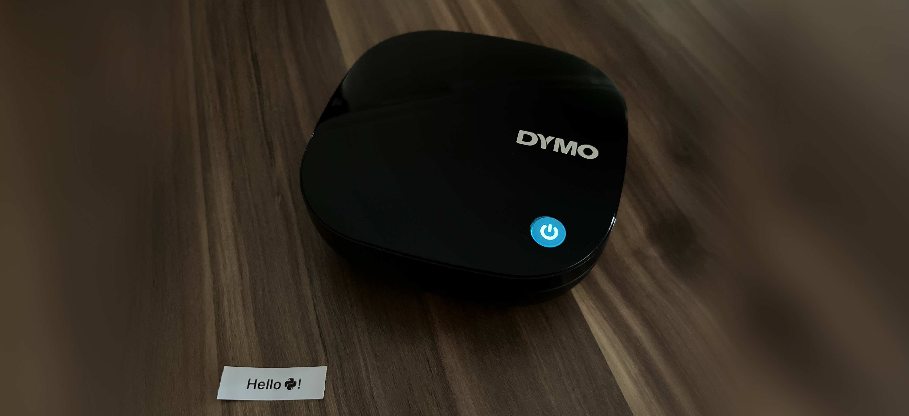

# dymo-bluetooth

Use DYMO LetraTag LT-200B thermal label printer over Bluetooth in Python, without depending on its app.

I was not expecting to own a label printer, but after caming across to this online, I thought why I shouldn't get it for whatever reason since it was affordable. After a while, I decided to tinker with this printer so I can print anything whatever I would like instead of being limited with its mobile app, so here it is.



<details>
<summary>More about this printer model</summary>
<br>

This printer doesn't use inks, it instead writes on the labels with thermal. And obviously, it does require a label cartridge (or called "casette"). From what I've seen, all LetraTag branded label casettes have the same shape and dimensions, so it is easy to get another if the casette that came with the printer runs out. There are different kind of labels (paper, plastic, metalic etc.) available, and all of them are self-adhesive. The casettes don't have an electronical part, which makes the printer to be able to use casettes manufactured by someone else.

The label dimensions are 12 millimeter in height, however the printable area is just 32 pixels, so labels will have an very obvious white space even if all printable space is filled with black. The print resolution is 200 DPI and, as stated on the original website, it has a print speed of up to 7 millimeters per second. So unfortunately the print resolution is not perfect for everything, but still, it does its job, and in the end, I enjoyed playing around with this printer, even if it didn't have anything that extraordinary.

</details>

## Compatibility

* DYMO LetraTag LT-200B

Seems to be this is the only printer by DYMO that uses Bluetooth. If you know or own a DYMO printer that uses Bluetooth and you believe needs to be supported, don't hesitate to open a new issue.

This project depends on [`bleak`](https://pypi.org/project/bleak/) for cross-platform Bluetooth communication, therefore you can only use this project on system where `bleak` is supported. Thus, either; Linux distribution with BlueZ >= 5.43 support, MacOS with at least version 10.11 or Windows build 16299 or greater is required.

## Installation

```
python -m pip install --upgrade dymo-bluetooth
```

For `main` branch, you can use `https://github.com/ysfchn/dymo-bluetooth/archive/refs/heads/main.zip` as package name.

Python 3.10 or up is targeted, but 3.9 should work too. It depends on;

* `bleak` for Bluetooth communication.
* `pillow` for importing & converting images to monochrome images.

Additionally, if `python-barcode` is installed (which is optional), it can be also used to print barcodes.

## Usage

There is a CLI provided with the module to print images to the first found printer nearby. If looking for a test image, you can try [this.](https://github.com/ysfchn/dymo-bluetooth/blob/main/assets/example_image.png)

```
python -m dymo_bluetooth --help
```

Or in a Python program:

```py
from dymo_bluetooth import discover_printers, Canvas
import asyncio

async def main():
    # Canvas class allows constructing 1-bit images in ease.
    canvas = Canvas()

    # Pixels can be set and retrieved with methods.
    canvas.set_pixel(0, 0, True)

    # Images needs to be stretched by at least 2 times like
    # how its mobile app does, otherwise printer will render
    # the labels too narrow.
    canvas = canvas.stretch(2)

    # Get a list of printers.
    printers = await discover_printers()

    # Get the first discovered printer and print the 
    # constructed Canvas. Returns the print status.
    await printers[0].print(canvas)

asyncio.run(main())
```

## Notes

Some things to note while using the printer:

* The printer won't print anything if the lid is open, even if it may seem that it actually printed.
* If it doesn't print, make sure that all four batteries hold high enough charge, not a single battery should be low.
* If you hold the power button while the printer is on, it will automatically print its MAC address.

## License & Disclaimer

This program is licensed under [MIT License](./LICENSE).

It is distributed in the hope that it will be useful, but WITHOUT ANY WARRANTY; without even the implied warranty of MERCHANTABILITY or FITNESS FOR A PARTICULAR PURPOSE. See MIT license for details.

This program is not supported, sponsored, affiliated, approved, or endorsed in any way with DYMO. LetraTag is an trademark of DYMO. All other mentioned trademarks are the property of respective owners.

## Protocol

This printer uses Bluetooth LE (GATT) to send labels & retrieve its status. It does uses this service UUIDs:

|  UUID  | Used for |
|:------:|:--------:|
| `be3dd650-2b3d-42f1-99c1-f0f749dd0678` | Service |
| `be3dd651-2b3d-42f1-99c1-f0f749dd0678` | [Print request (write -> printer)](#print-request) |
| `be3dd652-2b3d-42f1-99c1-f0f749dd0678` | [Print reply (notify <- printer)](#result) |
| `be3dd653-2b3d-42f1-99c1-f0f749dd0678` | Unknown |

`2b3d` part in the UUID may not be future-proof, but so far all produced printers of the same model seems to share the same UUID.

To discover the nearby printers, you can filter for the service UUID. So far the MAC addresses to which this printer is assigned seem to belong to the chip manufacturer itself; Espressif, so it may not be possible to pinpoint a DYMO printer by its MAC address, but this project contains a list of MAC prefixes that seen with the printer anyway.

All data structures are explained below so it can be used as a future reference.

### Directive

Directives are simply command types that found in the [payload](#payloads). A directive directly follows another directive, and so on. A payload may contain more than one directive.

Each directive consists of 2 bytes, first byte is always an ASCII escape character `1B` (in hexadecimal, or 27 in decimal), and second byte is the ASCII code point of the character that specifies the command type.

```
COMMAND_TYPE[1] = 73 | 4D | 43 | 44 | 45 | 41 | 51
DIRECTIVE[2] = 1B + COMMAND_TYPE[1]
```

|  Command  |  Character  | = Code point (hex) | = Code point (decimal) |  Notes  |
|:------:|:-------------------:|:------------------:|:------------:|:-------:|
| [`START`](#start-command) | `s` | `0x73` | `115` | Start command. Each payload starts with this directive. |
| [`MEDIA_TYPE`](#media_type-command) | `M` | `0x4d` | `77` | ? |
| [`PRINT_DENSITY`](#print_density-command) | `C` | `0x43` | `67` | ? |
| [`PRINT_DATA`](#print_data-command) | `D` | `0x44` | `68` | Prints an image to the label. |
| [`FORM_FEED`](#form_feed-command) | `E` | `0x45` | `69` | Follows after `PRINT_DATA`. |
| [`STATUS`](#status-command) | `A` | `0x41` | `65` | Requests the status (?) |
| [`END`](#end-command) | `Q` | `0x51` | `81` | End command. Each payload ends with this directive. |

Below is the structure of each command that follows after its directive:

#### `START` command

Each payload starts with directive. This command follows with 4 constant bytes (`9A 02 00 00`) after its directive.

```
START[6] = DIRECTIVE[2] + 9A 02 00 00
```

#### `MEDIA_TYPE` command

This command follows with 1 byte containing a number of some type (?) to be set for the printer. It doesn't really seem to be used by this printer, but this command was discovered in its mobile app anyway.

When this number has set to anything, the printer should advertise this number when searching for Bluetooth devices nearby. (not tested) So I guess it was planned to be used for some sort of casette checking & changing casette type, so printer can hold this value even when its turned off.

```
MEDIA_TYPE[3] = DIRECTIVE[2] + XX
```

#### `PRINT_DENSITY` command

Seems unused by the printer. Not sure what it does.

```
PRINT_DENSITY[?] = DIRECTIVE[2] + ...
```

#### `FORM_FEED` command

Used after [`PRINT_DATA`](#print_data-command) command. Doesn't take additional bytes other than its directive.

```
FORM_FEED[2] = DIRECTIVE[2]
```

#### `STATUS` command

Used after [`FORM_FEED`](#form_feed-command) command. Doesn't take additional bytes other than its directive.

```
STATUS[2] = DIRECTIVE[2]
```

#### `END` command

Each payload ends with directive. Doesn't take additional bytes other than its directive.

```
END[2] = DIRECTIVE[2]
```

#### `PRINT_DATA` command

This command defines the data of the image that will be printed to the label. It is followed by:

* Bits per pixel value; this is always equals to `1`, so in hex that would be `0x01`.

* Alignment; this is always equals to `2`, so in hex that would be `0x02`. This is always seems the case regardless of the content of the image, so not sure how printer will react for values other than `2`.

* Width of the image. This value consists of 4 bytes, in little-endian. Since the label is printed horizontally, it might be changed based on your input image, so continue reading about image format.

* Height of the image. This value consists of 4 bytes, in little-endian. Since labels can only contain 32 pixels from top to the bottom, simply use 32 as a height, so in hexadecimal, that would be: `20 00 00 00`

* Image data, see ["Image format"](#image-format).

```
# Printer have fixed 32 pixel size
HEIGHT[4] = 20 00 00 00

PRINT_DATA[variable] = DIRECTIVE[2] + 01 02 + WIDTH[4] + HEIGHT[4] + IMAGE_DATA[4 * WIDTH]
```

### Image format

The printer expects labels in portrait direction, encoded as 1-bit monochrome images. To put it simply, it uses bits (`1` and `0`) to set each pixel, and since a byte contains 8 bits, the printer will require 4 bytes (4 * 8 = 32 pixels, which is the height of the printable area) to print a full line from top to the bottom. Each 4 bytes are big-endian on its own.

```
    8 bits                                                                   4 bytes = 32 bits (8 * 4) = 1 printing line
┌─────────────┐                                                            ┌─────────┐
│             │                                                            │         │
0 0 0 0 0 0 0 0   0 0 0 0 0 0 0 0   0 0 0 0 0 0 0 0   0 0 0 0 0 0 0 0  ->  00 00 00 00  -> 1 full empty line
    binary            binary            binary            binary               hex

1 1 1 1 1 1 1 1   1 1 1 1 1 1 1 1   1 1 1 1 1 1 1 1   1 1 1 1 1 1 1 1  ->  FF FF FF FF  -> 1 full black line
    binary            binary            binary            binary               hex
```

So, the first left-top pixel (X = 0, Y = 0) is inserted in the least significant byte, and the biggest bit in that set.

```
0 0 0 0 0 0 0 0   0 0 0 0 0 0 0 0   0 0 0 0 0 0 0 0   1 0 0 0 0 0 0 0  ->  00 00 00 80  -> 1 pixel in [x = 0, y = 0]
    binary            binary            binary        │   binary               hex
                                                      │
      0                 0                 0           └─── 128
   decimal           decimal           decimal           decimal
```

As explained above, line always take up 4 bytes, so the image width can be found by dividing the byte count to 4. And since the image height doesn't vary (labels are printed horizontally in this printer, from left to right) the image height is always 32 pixels.

Each line is directly followed by another line (if any), so there is no additional separator between lines, and it is ordered sequentially, so the first 4 bytes in the image data will be the first line that will be printed out on the label.

### Payloads

There are 2 payloads that can be sent to the printer. Each payload starts with an [`HEADER`](#header), and it does follow with the payload data.

|  Payload  |  Requires chunking?  |  Usage   |
|:---------:|:------------------:|:---------:|
| [Print request](#print-request) | Yes | Sends an image to be printed out on the label. |
| [Set media type](#set-media-type) | No | ? |

#### Magic value

Magic value consists of 2 bytes, which is `12 34` (in hexadecimal) or [18, 52] in decimal.

```
MAGIC[2] = 12 34
```

#### Header

Header consists of 9 bytes in total. First two bytes are constant, which is `FF F0`. Third and forth byte is [`MAGIC`](#magic-value), which is explained above. And it is followed by the length of the payload stored in 4 bytes (little-endian) that is going to follow after this header.

The ninth byte of the header is the checksum of the header, and it is calculated by simply getting sum of the all previous 8 bytes and getting the first byte of the sum.

```
PARTIAL_HEADER[8] = FF F0 + MAGIC[2] + PAYLOAD_LENGTH[4]

CHECKSUM[1] = SUM(PARTIAL_HEADER) & 0xFF

HEADER[9] = PARTIAL_HEADER[8] + CHECKSUM
```

#### Print request

A print request payload consists of these directives; [`START`](#start-command), [`PRINT_DATA`](#print_data-command), [`FORM_FEED`](#form_feed-command), [`STATUS`](#status-command) and [`END`](#end-command) respectively. Directives follow after [`HEADER`](#header), so it would be the first.

```
PRINT_REQUEST[variable] = HEADER[9] + START[6] + PRINT_DATA[variable] + FORM_FEED[2] + STATUS[2] + END[2]
```

Due to both the way the printer works and the way the Bluetooth itself work, this payload needs to be broken down into chunks in each 500 bytes. Each chunk must be send separately over Bluetooth, the printer will start printing until it receives the last chunk.

Chunking needs to be start right after [`HEADER`](#header), so only the header is sent first (which is the 9 bytes), then the each chunk is separately sent via Bluetooth. So number of the total Bluetooth writes would be `1 + chunk count`.

Each chunk must contain its index before chunk data itself followed by. The chunk data can be smaller than 500, but it can only contain maximum 500 bytes, inclusive. In the end, you will have the full chunk to be sent over Bluetooth which contains the index and the data.

```
CHUNK[1...501] = CHUNK_INDEX[1] + CHUNK_DATA[0...500]
```

The last chunk must contain the [`MAGIC`](#magic-value) value appended end of the chunk.

```
CHUNK[3...503] = CHUNK_INDEX[1] + CHUNK_DATA[0...500] + MAGIC[2]
```

#### Set media type

A media type set payload consists of these directives; [`START`](#start-command), [`MEDIA_TYPE`](#media_type-command) and [`END`](#end-command) respectively. Directives follow after [`HEADER`](#header), so it would be the first.

```
SET_MEDIA_TYPE[20] = HEADER[9] + START[6] + MEDIA_TYPE[3] + END[2]
```

This payload doesn't require chunking and can be sent with single Bluetooth transaction.

### Result

Printer will notify on the [print reply UUID](#protocol), giving the status of the printing operation. First byte is always an ASCII escape character `1B` (in hexadecimal, or 27 in decimal), and second byte is the ASCII code point of the `R` character (`0x52` in hexadecimal, or 82 in decimal) that stands for the result. 

Third byte represents the status code. The printer is inconsistent when it comes to the status codes, so we can't be always fully sure if it actually did print. But the printer has several status codes anyways for some specific situations.

```
RESULT[3] = 1B 52 + STATUS[1]
```

#### Status codes

|  Value  |  Did print?  |  Meaning  |
|:-------:|:-------------:|:----------|
| `0` | Maybe* | Printing has completed. |
| `1` | Yes | Printing has completed (or still ongoing?). |
| `2` | No | Failed for an unknown reason. |
| `3` | Yes | Printed but the battery is low, probably won't be able to print again with same batteries. |
| `4` | No | Failed to print because the operation was cancelled. |
| `5` | No | Failed for an unknown reason, like `2`. Don't really know when it does return that. |
| `6` | No | Failed to print because the battery is low. |
| `7` | No | Failed to print because casette was not inserted. On my tests, printer never sends this status, instead it will spin its gear even casette is not inserted and sends `0` instead. |

\* It is a "maybe", because for some cases, printer tells it did print even when it actually didn't. (e.g. the casette was not inserted, or the lid is open)
